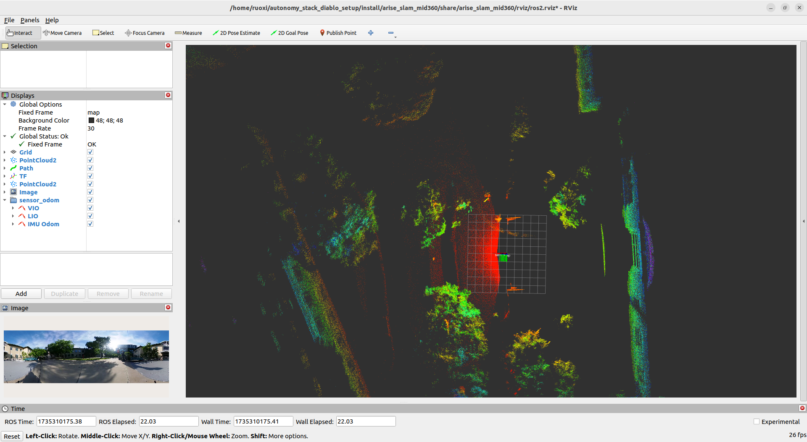

# Build Log

```bash
colcon build --symlink-install --cmake-args -DCMAKE_BUILD_TYPE=Release --packages-select arise_slam_mid360
```

## ceres-solver-2.2.0

need noticed `LocalParameterization` has been removed, use `Manifold` instead compared with `ceres-solver-2.1.0`

- [Ceres version_history](http://ceres-solver.org/version_history.html)
- [LocalParameterizations are deprecated in Ceres Solver 2.1.0 ](https://github.com/colmap/colmap/issues/1475)
- [Ceres Manifolds/LocalParameterization 类](https://blog.csdn.net/qq_28087491/article/details/135488678)

## download rosbag

[A few example bagfiles are provided here](https://drive.google.com/drive/folders/1vAsyT_g1kLnexpgNawolVu3CO2NHYDB-?usp=sharing)

you can download these files by the following command with the link copied from the browser download button and remove the `&at=xxxxxxxxxx` part at the end, a case in point is:

```bash
wget --no-check-certificate "https://drive.usercontent.google.com/download?id=...&uuid=" -O nsh_building_outdoor.db3
```

```bash
wget --no-check-certificat "https://drive.usercontent.google.com/download?id=...&uuid=" -O cic_building_indoor.db3
```

## arise_slam_mid360

### play ros2 bag in one terminal
```bash
ros2 bag play nsh_building_outdoor.db3 --loop --clock
```
or

```bash
ros2 bag play cic_building_indoor.db3 --loop --clock
```
### run arise_slam_mid360 in another terminal

```bash
source install/setup.bash
ros2 launch arise_slam_mid360 arize_slam.launch.py 
```
